# LCARS — dashboard design language

This document describes how an LCARS dashboard is put together: the layouts,
the components that fill them, and the strategies for organising real systems
onto screens. It is deliberately **implementation-agnostic** — everything here
is described graphically and physically, so it applies whether the dashboard
is rendered by this engine or rebuilt in any other technology. For
engine-specific mechanics, see `ENGINE.md`.

---

## 1. What LCARS is

LCARS ("Library Computer Access/Retrieval System") is the fictional Star Trek
computer interface. Visually it is defined by a few strong conventions, and a
good dashboard leans into all of them:

- **Framing elbows.** Content sits inside rounded "elbow" frames — a thick
  coloured bar runs along an edge and bends 90° into a side rail. The bend is
  the signature shape.
- **Flat, saturated colour blocks.** No gradients on the chrome, no drop
  shadows. Colour is used categorically — a colour *means* something — and is
  drawn from a fixed, named palette per theme. Themes change which palette
  colour plays which role; the roles themselves are constant.
- **Dense, labelled readouts.** Numbers everywhere, in tight columns, often
  with cryptic alphanumeric tags. Information density is part of the
  aesthetic.
- **Rounded pill shapes.** Controls are stadium-shaped pills; bars end in
  half-round caps; meters are built from discrete segments. Straight cuts
  between segments are separated by thin black gaps at two fixed widths — a
  narrow gap between the parts of a component, a wider gap between rows of
  controls.
- **Black is the canvas.** The background is pure black; every shape floats
  on it. Text sits either directly on black or as black-on-colour inside a
  filled shape.

The job of a dashboard is to take live home/ship telemetry and present it in
this idiom: grouped into framed regions, colour-coded by meaning, with the
things you can *act on* clearly distinct from the things you only *read*.

---

## 2. Dashboard layouts

A layout is the fixed chrome of a screen — the frame that identifies the page,
carries navigation, and bounds the content area. These are the layouts from
the original TheLCARS.com template family; more will be added over time.

### Standard

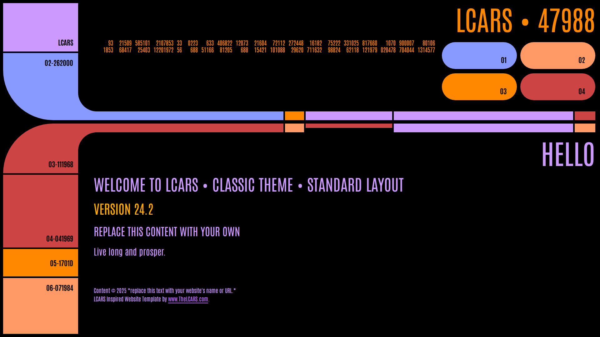

The workhorse. A tall **sidebar column** runs down the left edge, split into
stacked coloured panels; the top panel block bends through an elbow into a
pair of **horizontal header bars** that run across the page. The banner (site
and page identity) sits top-right in large type. Content occupies the large
black region right of the sidebar and below the header bars.

- Sidebar panels double as **page-to-page navigation**; the current page's
  panel is lit in a highlight colour.
- The area under the banner holds a short row of **quick controls** for the
  current page's system.
- A second elbow closes the frame at the bottom of the sidebar.

In service, sized to exactly fill a wall-mounted display with no scrolling:

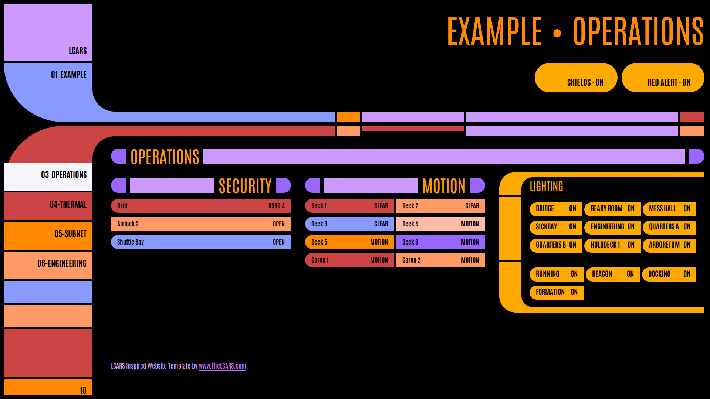

### Ultra

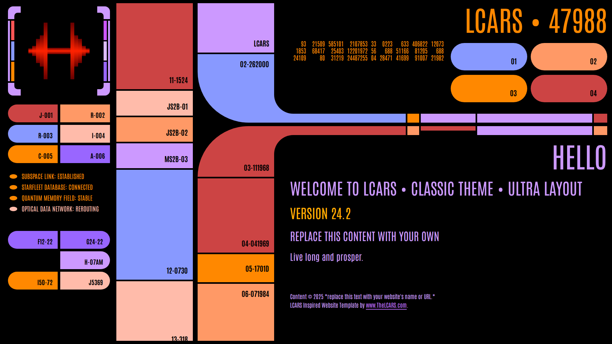

A heavier, busier frame for showcase screens. Instead of one sidebar, the
page is walled by **multiple full-height columns** of stacked blocks and
labelled cells, with bars threading between them through elbows on both
sides. Content sits in a black well amid the columns. Ultra trades content
area for atmosphere — it reads as a bridge station rather than a wall panel.
Use it where the frame itself is the point; prefer Standard when data density
matters.

### PADD

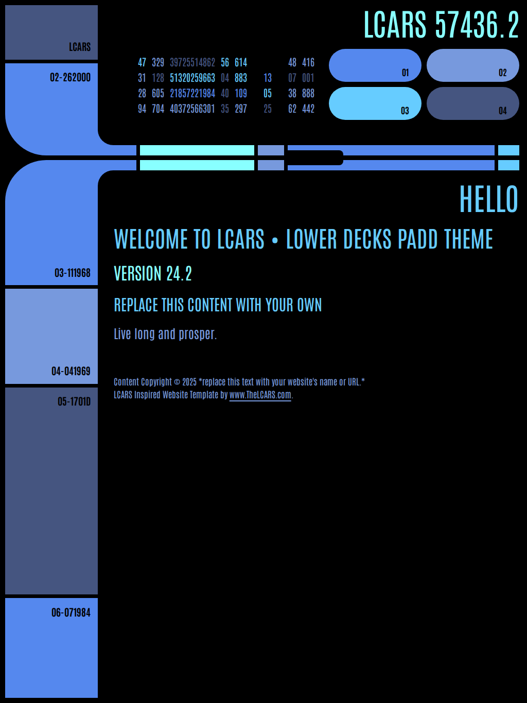

The handheld variant — a Standard-like frame proportioned for a tablet held
in portrait. The sidebar narrows, the header compresses, and content flows in
a single column. Use for touch devices carried around rather than mounted.

---

## 3. Components

The pieces that fill a layout's content area. Each entry notes what kind of
data it presents: **read-only** (display only), **control** (touching it acts
on the real system), or **structure** (organises other components).

### Structure and navigation

#### Text bar — structure

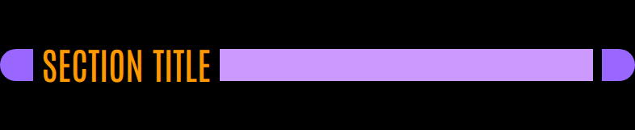

The section heading: a rounded end cap, the title in large type on black, a
long coloured bar, and a closing end cap, with even gaps between the pieces.
It divides a page the way a heading divides a document. The title can also sit
at the far end of the bar for right-aligned emphasis:

#### Bezel (elbow frame) — structure

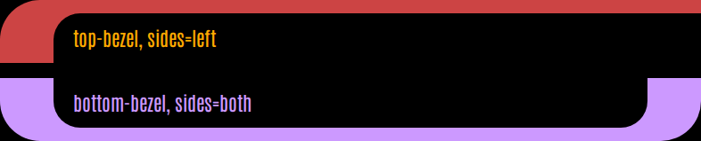

The signature elbow frame: a coloured bar along the top or bottom edge that
bends into one or both side rails, wrapping a black content area. A top piece
and bottom piece stack to box a group; middle pieces are inserted between
them for additional sub-groups, each separated by the narrow gap. The frame's
colour is the group's **category colour**.

House rule: **primary sectioning uses bezels, secondary sectioning uses
bars.** Bezels are reserved for the page's top-level groups — especially
control clusters — while text bars carry the rhythm inside and between them.

#### Side panels — navigation

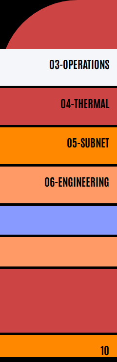

The stacked coloured blocks of the Standard sidebar. Each named panel links
to a sibling page; the current page's panel is lit. Unused positions stay as
short inert filler blocks so the column keeps its classic rhythm.

#### Button row — navigation / control

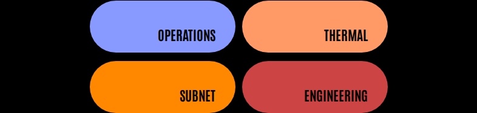

A horizontal run of stadium buttons, coloured by position. In the page
header it carries the page's **quick controls** — the one or two actions you
would reach for first on this screen, acting on this page's own system (not
links to other pages):

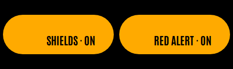

### Read-only displays

#### Status pillbox — read-only

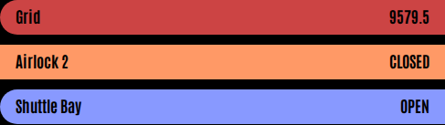

A grid of stadium pills, each carrying a label and a short state word or
number. The workhorse for boards of like sensors — motion by room, doors,
presence. Pills are tinted by position from the theme palette; a state that
demands attention can override with the alert colour. Columns are separated
by the narrow gap, rows by the wide gap.

#### Readout stack — read-only

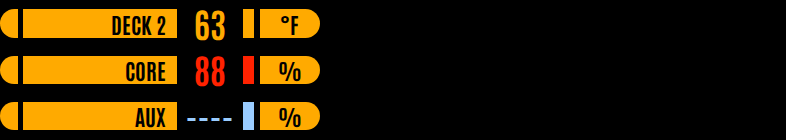

Instrument lines: each row is a rounded start cap, the entity's name on a
coloured block, its value in large type on black, a small colour-coded chip,
and a rounded end cap carrying the unit. All rows in a stack share the same
column widths so values align vertically. The value and chip take a colour
graded by level — cool for low, warm for mid, alert for high.

#### Bar chart — read-only

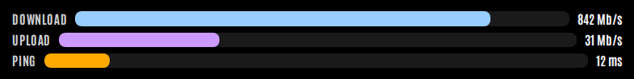

A handful of comparable magnitudes as horizontal bars — label left, track
with a filled portion centre, value right. Each bar can carry its own scale,
unit, and colour. Good for at-a-glance comparison: throughput, humidity,
battery levels.

#### Level meter — read-only

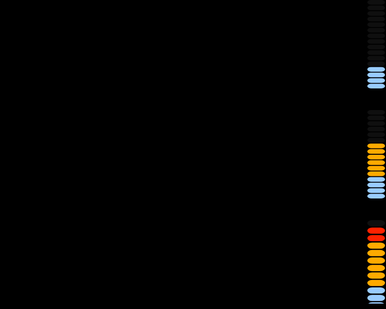

A vertical segmented gauge, VU-meter style: a stack of pill segments lights
from the bottom up, each lit segment coloured by its height in the scale
(cool → warm → alert). Best for a single value with a meaningful range —
temperature, capacity, load. Meters sit side by side in a labelled row:

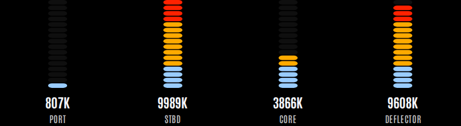

#### Pill gauge — read-only

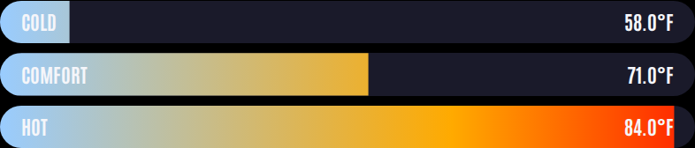

A single value shown as one stadium pill whose fill sweeps from left to
right, revealing a cool-to-alert gradient up to the value's position. A
softer, larger-format alternative to the level meter when one number deserves
its own shape.

#### Data cascade — read-only

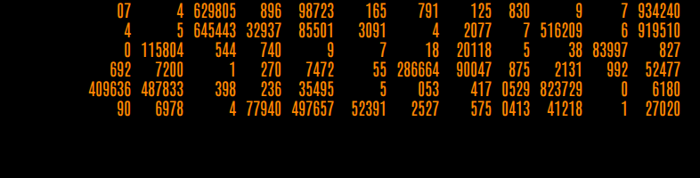

The animated number grid: columns of short figures that flicker and cycle
colour by row. The classic LCARS texture for "lots of telemetry at once" —
each cell can be a live value with per-cell threshold colouring, mixed freely
with decorative filler. In service, carrying live machine telemetry:

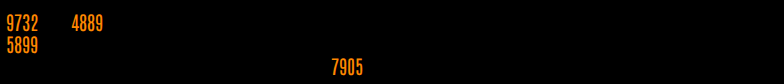

### Controls

Everything actionable is a stadium pill or button; pressing it acts on the
real system, and the shape immediately reflects the new state.

#### Toggle button — control

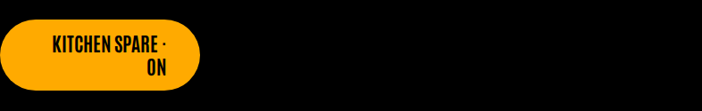

A single large stadium button carrying a device name and its state. Lit in
the active accent colour when on; dimmed when off. Used in the header's quick
controls and anywhere one action stands alone.

#### Control cluster — controls, framed

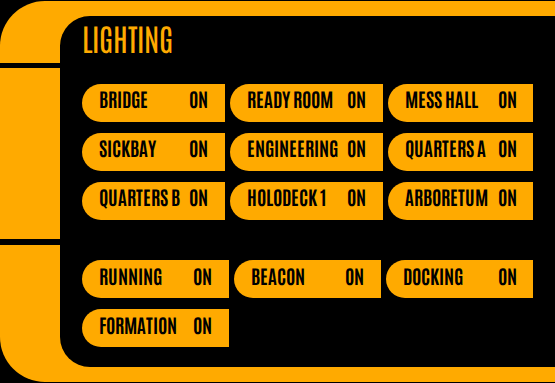

The house pattern for banks of switches: a bezel boxes the group, the frame's
top piece carries the group title, and each sub-group of pill toggles gets its
own framed piece (here: interior and exterior lighting). Lit pills show the
active accent; unlit pills sit dim. The frame states, at a glance: *everything
inside this elbow is something you can touch.*

### Secondary and media

#### Accordion — structure

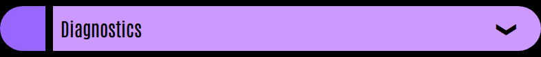

A collapsible drawer for detail that shouldn't compete for space —
diagnostics, maintenance readouts. A full-width bar as the handle; the body
unfolds beneath it.

#### Image frame — media

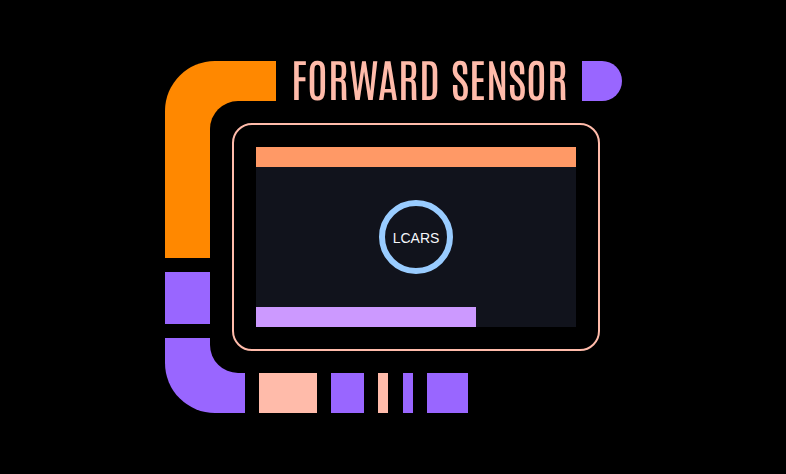

A titled, bordered still image with the LCARS base blocks beneath — camera
snapshots, floor plans.

#### Gallery — media

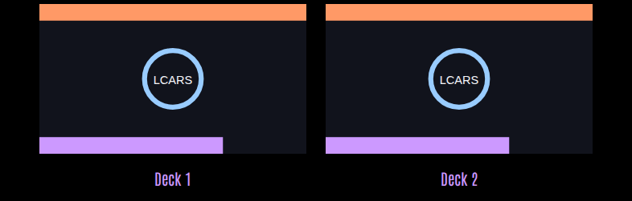

A simple image grid with optional captions, for sets of stills.

### Vocabulary

#### Colour palette

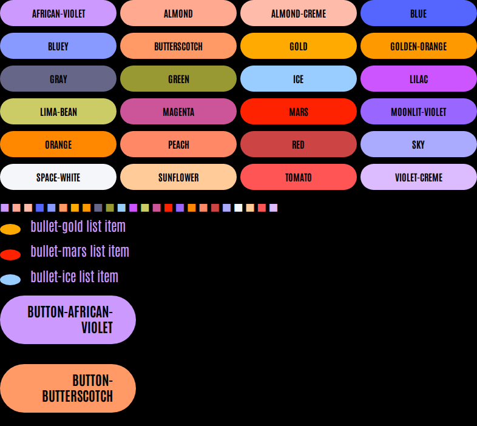

Every theme exposes a fixed set of **named colours** (the decorative
vocabulary) and a set of **roles** — which name plays the frame, the text,
the active accent, the alert, the gauge gradient. Components reference roles;
authors may reach for a named colour deliberately, as decoration. The names
are immutable across themes; the role assignments are what a theme changes.

#### Attention states

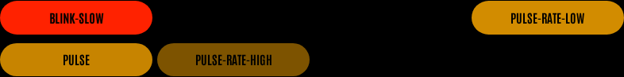

Two animated states, each in three rates: **blink** (hard on/off) and
**pulse** (brightness breathing). Reserve them for conditions that genuinely
need eyes on them — an alarm, a failed system. A dashboard that always blinks
alerts no one.

---

## 4. Layout strategies

How to organise a real home or ship onto pages. Two base strategies, usually
mixed.

### Area layout

Sort every entity by physical location, and make each area a group: a page
(or bezel) per floor, room, or zone. Each area group mixes data kinds — the
kitchen group holds its temperature, its motion, its lights.

- **Reads naturally for people moving through the space** — "show me the
  kitchen" is one glance.
- Suits **presence-centric** screens: occupancy boards, per-room comfort.
- Weakness: like controls scatter — turning off *all* lights means visiting
  every area group.

### Functional layout

Group by system, regardless of location: all lighting together, all HVAC
together, all security, all network. Each page owns one function, pairing
that function's telemetry (read-only sections) with its switches (a control
cluster) on the same screen.

- **Reads naturally for operating a system** — the thermal page shows every
  temperature *and* the switches that change them.
- Suits **wall consoles and kiosk screens** dedicated to running the house:
  one page per subsystem, sidebar navigation between them (Operations /
  Thermal / Network / Engineering).
- Weakness: answering "what is happening in the galley" spans pages.

### Choosing and mixing

- **Match the strategy to the question the screen answers.** A hallway
  display people walk past favours areas; an engineering console favours
  functions.
- The common hybrid: functional pages, with **area-ordered groups inside
  them** — the lighting cluster splits interior/exterior, the temperature
  row orders rooms by deck.
- **Keep the read/act distinction stronger than the grouping.** Whatever the
  strategy, actionable pills belong inside bezel-framed clusters and
  read-only data in bar-headed sections, so the hand always knows where it's
  allowed.
- **One screen, one job, no scrolling.** Size each page to its display; if a
  page needs to scroll on its intended mount, it holds too much — split it.
- **Colour before position.** A category colour (security red, network blue)
  carried consistently across pages does more wayfinding than any amount of
  layout.
