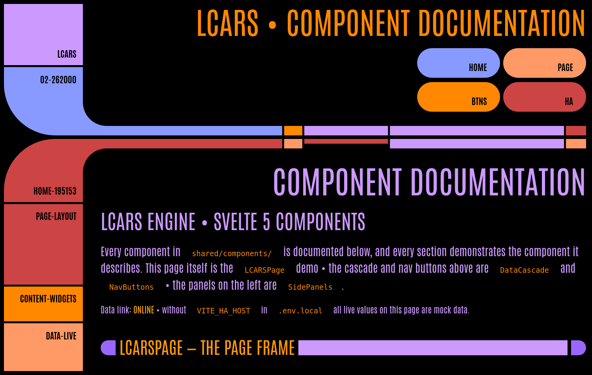
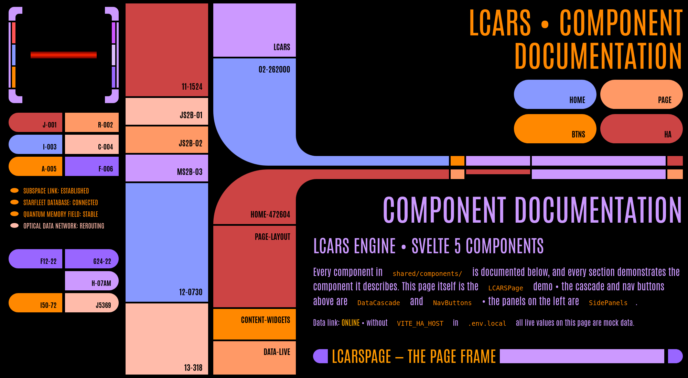

# LCARS Engine

Star Trek LCARS dashboards for Home Assistant, as tiny static websites.

| Standard layout | Ultra layout |
|---|---|
|  |  |

**Live demo:** [component documentation](https://adejong5.github.io/lcars-engine/sites/test/) · [PADD theme](https://adejong5.github.io/lcars-engine/sites/padd/) (running on mock data)

## Why

Old tablets and wall-mounted screens make great Star Trek-style status panels — except their browsers choke on the modern Home Assistant frontend. A dashboard that worked fine a few years ago becomes a white screen after an HA update.

This project sidesteps that: each dashboard is a small static page (tens of kilobytes of JS) that talks directly to Home Assistant over its WebSocket API. No HA frontend, no heavy framework runtime — just enough JavaScript to push live entity states into an LCARS display. Old hardware stays on the wall.

## What it is

A [Svelte 5](https://svelte.dev) + [Vite](https://vite.dev) re-implementation of the LCARS website template from **[TheLCARS.com](https://www.thelcars.com)**, extended with a reactive Home Assistant data layer:

- **Component library** (`shared/components/`) — the page frame, "elbow" bezel frames, data cascade, side panels, buttons, pillboxes, accordions, image frames and galleries, plus data-viz pieces (bar charts, segmented level meters, pill gauges) — reproducing the original template's markup exactly, so its theme stylesheets (classic, nemesis-blue, lower-decks, PADD) apply unmodified.
- **Standard and ultra layouts** — the original template's two page arrangements, switchable with a prop.
- **Live data** (`shared/ha.svelte.js`) — a fine-grained reactive store over the HA WebSocket API: read `ha.state('sensor.warp_core_temp')` in any component and the cell updates when HA pushes a change. Includes a **mock mode** that fabricates plausible drifting telemetry, so everything can be developed offline.
- **AI-authored, against your real Home Assistant** — the repo ships two documents written for an AI coding agent: `CLAUDE.md` (the working agreement for the codebase) and `ENGINE.md` (a design guide covering the LCARS idiom, the page/section hierarchy, which component fits each kind of entity, and read-only displays vs. actionable controls). Once you give the agent your HA host and token (see below), it can **enumerate the entities you actually have** straight from the HA API and wire your real entity ids into the dashboard — no guesswork, no placeholder data.
- **Multi-site** — the repo hosts any number of independent dashboard pages under `sites/`, all sharing the components and themes.

All design, CSS, and sound effects originate from the LCARS Inspired Website Template by [www.TheLCARS.com](https://www.thelcars.com) — the attribution in each page footer is required by the template's terms and is built into the page component.

## How to use it: describe your dashboard to an AI

This repo is set up to be driven by an AI coding agent. It ships a `CLAUDE.md` (the codebase working agreement) and an `ENGINE.md` (a dashboard design guide), and the test site doubles as component documentation the agent can read. Connect Home Assistant **first** so the agent can build from your actual entities:

1. **Clone the repo** and open it with your agent of choice, e.g. [Claude Code](https://claude.com/claude-code).
2. **Connect Home Assistant first** by creating `.env.local` in the repo root:

   ```
   VITE_HA_HOST=192.168.1.x
   VITE_HA_TOKEN=<long-lived access token>
   ```

   Create the token in HA under *Profile → Security → Long-lived access tokens*. `.env.local` is gitignored, so it never leaves your machine. Doing this before you describe the dashboard lets the agent query your live HA and discover the entities you really have — for example:

   ```bash
   curl -s -H "Authorization: Bearer $VITE_HA_TOKEN" \
     "http://$VITE_HA_HOST:8123/api/states" | jq -r '.[].entity_id' | sort
   ```

   (adjust the port if your HA isn't on `:8123`). Now the agent can pick real entity ids and group them sensibly instead of guessing.
3. **Describe the dashboard you want**, in plain language:

   > Make me a new site called "engineering" using the nemesis theme. Banner "USS PANDA — ENGINEERING". Show my power sensors in the data cascade, an accordion per room with its temperature and humidity, and red-alert styling when a water-leak sensor trips.

   You can be as specific or loose as you want. You don't need to know the entity ids — the agent reads `ENGINE.md` for how to structure the page, then pulls the matching entities (`sensor.*` power, per-room climate, `binary_sensor.*` leak) from your HA. You might ask the agent to make a few different versions so you can pick your favorite or iterate off them. 
4. The agent scaffolds `sites/engineering/` (three small files — every `sites/*/index.html` is auto-discovered by the build) and composes the page from the shared components with your real entity ids wired into the reactive store.
5. **Preview** with `npm run dev`. With `.env.local` set it shows live HA data; append `?mock` to the URL (or drop the credentials) to fall back to fabricated drifting telemetry for offline layout work.
6. `npm run build` and serve `dist/` from anything — a closet server, HA's own `www` folder, or GitHub Pages (this repo deploys its demo page there on every push).

> [!WARNING]
> **Keep builds with real tokens off public hosting:** the token is baked into the bundle, so a build made with `.env.local` is a secret-carrier — serve it only on your LAN.

### By hand

It's ordinary Svelte if you'd rather write it yourself — copy `sites/padd/` as a starting point, and use the [component documentation site](https://adejong5.github.io/lcars-engine/sites/test/) (source: `sites/test/App.svelte`) as the reference for every component and its props.

## Credits
This project is a heavily modified, Svelte + Vite-based extension of the LCARS Inspired Website Template originally created by Jim Robertus (www.TheLCARS.com).

This project is a non-commercial fan production. *Star Trek* and all related marks, logos, and characters are solely owned by CBS Studios Inc. This fan production is not endorsed by, sponsored by, nor affiliated with CBS, Paramount Pictures, or any other *Star Trek* franchise. 

No commercial exhibition or distribution is permitted. No alleged independent rights will be asserted against CBS or Paramount Pictures. This work is intended for personal and recreational use only.

The *Antonio* font is designed by Vernon Adams and is free to use in accordance with the SIL Open Font License, Version 1.1.

> [!IMPORTANT]
> By using, copying, or modifying this repository, you agree to be bound by the original End-User License Agreement (EULA) of the upstream template, alongside the additional attribution requirements for this Svelte/Vite extension. See [LICENSE.md](LICENSE.md) for more information.
